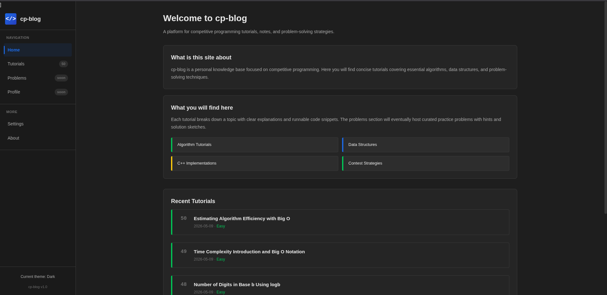

# cpblog

---

## Why I Started This Project 

When I first started competitive programming, I felt completely lost.  

Every tutorial I found either:
- Assumed I already knew half the things,  
- Skipped the small but crucial steps, or  
- Was full of motivational become a 10x coder nonsense  **bluff** with no substance.

I wasted weeks figuring out things like installing a compiler, setting up VS Code, or understanding why my `long long` overflowed.  
There was no single place that explained **everything clearly**, from environment setup to modular arithmetic.

So I built **cpblog**  the resource I wish I had when I started.  
Every tutorial is:
- **Selfcontained** (you dont need to open 5 tabs)  
- **Codefirst** (runnable examples immediately)  
- **Honest** (no fluff, just what works)

If this saves you even one evening of frustration, it was worth writing for me .

---

## Technologies Used

This is a pure frontend project so no frameworks, no backend, no build steps.(Until now .... I will update)
You can read and understand every line of code in minutes.

| Technology | Role |
|------------|------|
| **HTML** | Page structure, semantic layout, responsive meta tags |
| **CSS** | Dark theme, sidebar, animations, mobile responsiveness (CSS Grid & Flexbox) |
| **JavaScript** | SPA navigation, dynamic rendering of tutorials, event handling |
| **Local data (JS array)** | All tutorials are stored in `tutorials.js` |
---

##  Features & Functions (What the Code Does)

###  Tutorial System
- **List view** : shows every tutorial with title, topic, difficulty, read time, and tags.
- **Detail view** : full tutorial content (supports headings, lists, code blocks, tables).
- **Recent tutorials** : the 3 most recent tutorials appear on the home page.

###  About the Author
- Displays real stats (Codeforces rating, problems solved, streak).
- Links to Codeforces, HackerRank, GitHub, and email.

---

---

### The site is as above in the picture Until now I only wrote 3 tutorials I will write more in future.

## Updates with the time 

 2026-05-09 :
               Made 50 tutorials. 
               Updated the UI.
               Some functions edited.
               Applied theme switch possible.